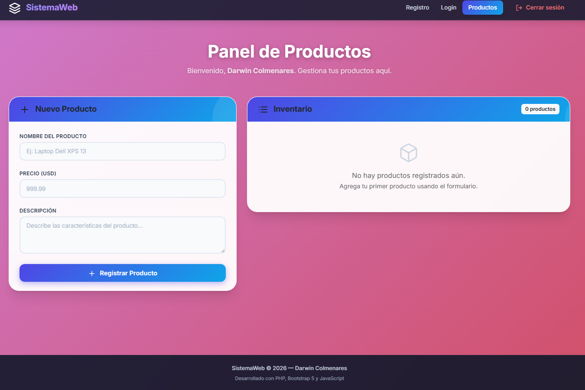
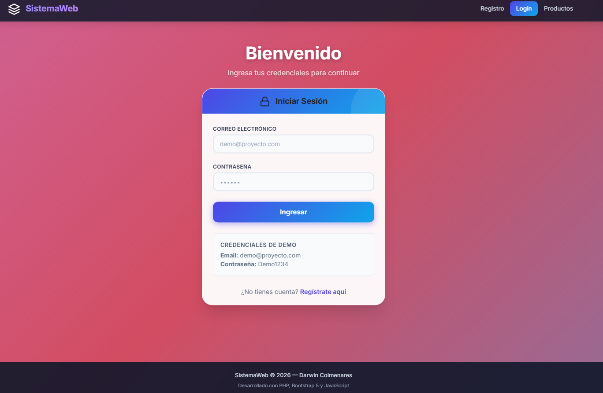
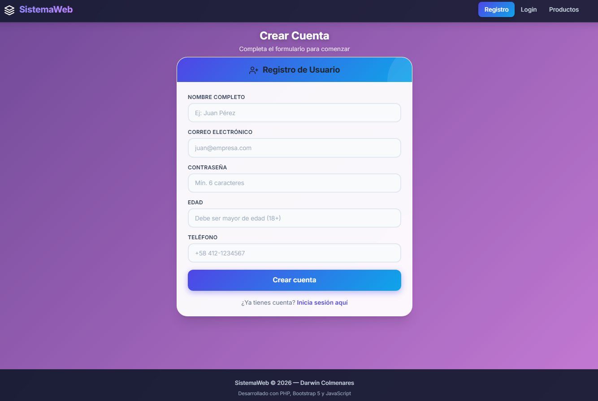
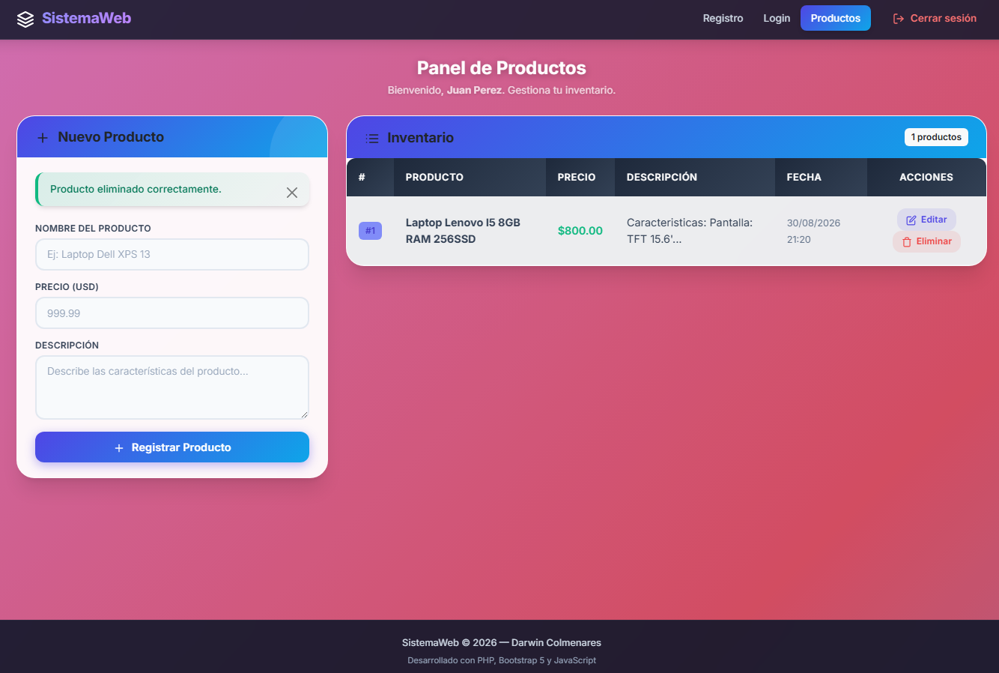

# 🚀 Sistema Web de Gestión — PHP + Bootstrap + JavaScript

Aplicación web full-stack desarrollada con **PHP**, **Bootstrap 5** y **JavaScript** que integra un flujo completo de autenticación y gestión de productos. Incluye registro de usuarios, inicio de sesión y un panel para administrar productos con operaciones **CRUD** (Crear, Leer, Editar, Eliminar), todo con validaciones en tiempo real y diseño responsive.

---

## 🛠️ Stack tecnológico

<p align="left"><a href="https://www.php.net/" target="_blank"></a><a href="https://getbootstrap.com/" target="_blank"></a><a href="https://developer.mozilla.org/es/docs/Web/JavaScript" target="_blank"></a><a href="https://developer.mozilla.org/es/docs/Web/HTML" target="_blank"></a><a href="https://developer.mozilla.org/es/docs/Web/CSS" target="_blank"></a><a href="https://www.json.org/" target="_blank"></a><a href="https://www.apachefriends.org/" target="_blank"></a><a href="https://git-scm.com/" target="_blank"></a><a href="https://github.com/" target="_blank"></a></p>

---

## ✨ Características principales

| Característica | Descripción |
|----------------|-------------|
| 🔐 **Autenticación** | Registro de usuarios e inicio de sesión con manejo de sesiones PHP |
| 📝 **Validaciones en tiempo real** | Formulario de registro con 5+ campos validados mediante JavaScript |
| 📱 **Diseño responsive** | Interfaz adaptable a cualquier dispositivo gracias a Bootstrap 5 |
| 📦 **CRUD de productos** | Crear, editar, eliminar y visualizar productos con persistencia en JSON |
| 💾 **Persistencia sin base de datos** | Los productos se almacenan en un archivo JSON local |
| 🧩 **Componentes reutilizables** | Footer modular con `include` de PHP |
| 🎨 **Diseño moderno** | Glassmorphism, gradientes animados y tipografía Inter |

---

## 📸 Vista previa

### 📝 Pantalla principal — Registro de Usuario


### 🔐 Inicio de Sesión


### 👤 Registro de Usuario (Formulario con 5+ campos validados con JS)


### 📦 Panel de Productos — CRUD completo


---

## ⚙️ Instalación y ejecución local

### Requisitos previos
- [XAMPP](https://www.apachefriends.org/) instalado (versión 8.2+ recomendada)
- [Git](https://git-scm.com/) instalado
- Navegador web moderno

### Pasos

1. **Clona el repositorio** en tu carpeta `htdocs`:
   ```bash
   cd C:\xampp\htdocs
   git clone https://github.com/TU_USUARIO/proyecto-web-php-bootstrap-javascript.git
   ```

2. **Verifica permisos de escritura** en la carpeta `data/`:
   - Asegúrate de que PHP pueda escribir en `data/productos.json`
   - En Windows esto funciona por defecto con XAMPP

3. **Inicia Apache** desde el XAMPP Control Panel.
   > Si el puerto 80 está ocupado, configura Apache para usar el puerto **8080** (ver [solución de puertos](#-solución-de-puertos-ocupados)).

4. **Abre tu navegador** en:
   ```
   http://localhost:8080/proyecto-web-php-bootstrap-javascript/
   ```
   o si usas el puerto por defecto:
   ```
   http://localhost/proyecto-web-php-bootstrap-javascript/
   ```

---

## 🔐 Credenciales de demostración

Puedes probar la aplicación directamente con estas credenciales:

| Campo | Valor |
|-------|-------|
| **Email** | `demo@proyecto.com` |
| **Contraseña** | `Demo1234` |

También puedes registrar un nuevo usuario desde la pantalla principal.

---

## 📁 Estructura del proyecto

```
proyecto-web-php-bootstrap-javascript/
│
├── index.php              # Registro de Usuario (5 campos + validación JS)
├── login.php              # Iniciar Sesión
├── producto.php           # CRUD de Productos (Crear, Leer, Editar, Eliminar)
├── footer.php             # Pie de página reutilizable (include)
├── .gitignore             # Archivos ignorados por Git
├── README.md              # Este archivo
│
├── assets/
│   ├── css/
│   │   ├── bootstrap.min.css
│   │   └── styles.css     # Estilos personalizados modernos
│   └── js/
│       ├── bootstrap.bundle.min.js
│       └── script.js      # Validaciones JavaScript
│
├── data/
│   └── productos.json     # Base de datos ligera en formato JSON
│
└── img/
    ├── pantalla-principal.png
    ├── inicio-sesion.png
    ├── registro-usuario.png
    └── registro-producto.png
```

---

## 🧪 Validaciones implementadas

### Formulario de Registro de Usuario (JavaScript)

| Campo | Regla de validación |
|-------|---------------------|
| **Nombre y Apellido** | Mínimo 3 caracteres, solo letras y espacios |
| **Email** | Formato de correo electrónico válido |
| **Contraseña** | Mínimo 6 caracteres, al menos 1 mayúscula, 1 minúscula y 1 número |
| **Edad** | Mayor de edad (18+) y menor a 120 años |
| **Teléfono** | Formato numérico válido (7 a 20 caracteres) |

> Las validaciones se ejecutan tanto al enviar el formulario como al salir de cada campo (*blur*), mostrando mensajes de error en tiempo real con estilos visuales.

---

## 📦 Funcionalidades CRUD de Productos

| Operación | Descripción |
|-----------|-------------|
| **Crear** | Agrega un nuevo producto con nombre, precio y descripción |
| **Leer** | Visualiza todos los productos en una tabla ordenada |
| **Editar** | Modifica cualquier producto existente en el mismo formulario |
| **Eliminar** | Borra productos con confirmación de seguridad |
| **Persistencia** | Los datos se guardan en `data/productos.json` y sobreviven al reinicio del navegador |

---

## 🔧 Solución de puertos ocupados

Si XAMPP muestra el error **"Port 80 in use"**, sigue estos pasos:

1. Abre `C:\xampp\apache\conf\httpd.conf`
2. Cambia `Listen 80` → `Listen 8080`
3. Cambia `ServerName localhost:80` → `ServerName localhost:8080`
4. Abre `C:\xampp\apache\conf\extra\httpd-ssl.conf`
5. Cambia `Listen 443` → `Listen 4443`
6. Reinicia Apache desde el XAMPP Control Panel

---

## 📄 Licencia

Este proyecto está disponible para uso libre. Siéntete libre de clonarlo, modificarlo y adaptarlo a tus necesidades.

---

## 👤 Desarrollador

**Darwin Colmenares**
- 💻 Desarrollador Web Full-Stack

---

<p align="center">
  <sub>Construido con 💙 usando PHP, Bootstrap y JavaScript (2026)</sub>
</p>